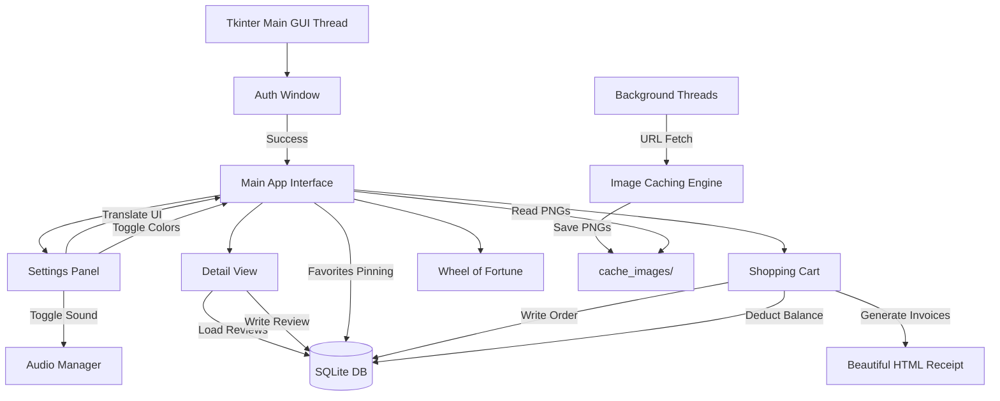

# 🏬 MEGAMARKET ALL-IN-ONE 🛒
> **A High-Performance Desktop Marketplace Application Built on Python Tkinter, Pillow, and SQLite**

[](https://www.python.org/)
[](https://docs.python.org/3/library/tkinter.html)
[](https://www.sqlite.org/)
[](LICENSE)

Welcome to **Megamarket All-in-One** — a robust, enterprise-grade desktop marketplace client designed to showcase modern Python GUI engineering. What started as a simple fruit store has been completely refactored into a high-performance shopping platform featuring a local SQLite database, multi-threaded image caching, dynamic search engine, real-time reviews, interactive mini-games, and dynamic HTML checkout invoicing.

---

## 📷 Screenshots (Вигляд програми)

### 1. Головне вікно програми (Каталог 500+ товарів та Пошук)


### 2. Вікно деталей товару (Характеристики, Кольори, Відгуки)


### 3. Перегляд кошика та оформлення покупки


---

## 📋 Table of Contents

1. [✨ Key Features](#-key-features)
2. [📦 Product Assortment (500+ Items)](#-product-assortment-500-items)
3. [⚙️ System Architecture](#-system-architecture)
4. [🛠️ Technology Stack](#-technology-stack)
5. [🚀 Installation & Setup](#-installation-&amp;-setup)
6. [📖 Comprehensive User Guide](#-comprehensive-user-guide)
7. [💻 Codebase & Database Schema](#-codebase-&amp;-database-schema)
8. [🤝 Contribution guidelines](#-contribution-guidelines)

---

## ✨ Key Features

* **📦 Massive Catalog (500+ Items):** 5 distinct categories, each housing exactly 100 uniquely generated items with dynamic descriptions, pricing, and custom specifications.
* **🌐 Async Threaded Image URL Loader:** Automatically fetches high-definition category illustrations from remote CDNs (Twemoji repositories) at startup using background `threading`. Downloads are cached locally in `cache_images/` to ensure lightning-fast subsequent launches.
* **🔒 User Authentication & Security:** Integrated signup/login startup window. User credentials are encrypted using SHA-256 hashes inside the local database.
* **⚙️ Unified Settings Dashboard:** A dedicated settings panel allows users to:
  * **Switch Languages:** Instant translation between **Ukrainian 🇺🇦**, **English 🇬🇧**, and **Russian 🇷🇺** without restarting.
  * **Toggle Themes:** Change between Light ☀️ and Dark 🌙 mode palettes dynamically.
  * **Control Audio:** Toggle retro sound indicators (`winsound` Beeps) on or off.
* **🔍 Real-Time Query & Filter Engine:** Instantly searches across hundreds of products as you type. Combined with category tab filter buttons and price sorting (Low to High / High to Low).
* **❤️ Smart Wishlist Pinned to Top:** Add items to your favorites with a single click. Favorites are saved in SQLite and **automatically pinned to the top** of the grid layout.
* **🎡 Fortune Wheel Mini-Game:** Canvas-drawn spinner game rewarding users with a 5%, 10%, or 15% discount for their shopping cart.
* **⭐ Interactive Review & Rating Module:** Calculate average star ratings from user feedback. Submitting a rating and text review updates the UI instantly.
* **📄 Detailed Delivery Checkout & HTML Receipts:** Checkout window gathers full name, validated phone number, email, address, delivery provider (Courier, Nova Poshta, Self-pickup), and payment type. Purchases generate a beautiful, production-ready HTML receipt locally on disk.

---

## 📦 Product Assortment (500+ Items)

Our catalog spans five diverse industries, containing 100 unique SKU variations each:
* **💻 Tech Department (`tech`):** Performance Laptops Pro Series (1 to 100) with custom color selections (Silver/Black).
* **🍎 Fresh Fruit Counter (`fruits`):** Farm-fresh Golden Apples (1 to 100) with rating scores and organic details.
* **💡 Home Decor (`home`):** Designer Loft Lamps (1 to 100) with white/black options.
* **⚽ Sports Gear (`sport`):** Hand-stitched Leather Soccer Balls (1 to 100).
* **👕 Clothing Line (`clothing`):** Cotton Classic T-shirts (1 to 100) in various sizes and colors.

---

## ⚙️ System Architecture



---

## 🛠️ Technology Stack

* **Programming Language:** Python 3.8+
* **GUI Engine:** Standard Library Tkinter
* **Graphics Processing:** Pillow (PIL) 10.0+
* **Database Engine:** SQLite3 (Local File-based SQL)
* **Network Operations:** Urllib standard library
* **Threading Module:** Standard `threading` library
* **Audio Library:** Standard `winsound` library

---

## 🚀 Installation & Setup

### Prerequisites
Make sure Python 3.8 or newer is installed. Then install the required packages:

```bash
pip install pillow
```

### Installation
Clone the repository:
```bash
git clone https://github.com/greenyarik0505-jpg/Privet.git
cd Privet
```

### Execution
Run the main script to start the Megamarket:
```bash
python main.py
```

---

## 📖 Comprehensive User Guide

### 1. Getting Started
* Run the application. On the startup login window, choose **Реєстрація** (Register) to create a new profile or **Увійти** (Login) to log in.
* Upon login, your account is credited with a default wallet balance.

### 2. Customizing Your Experience
* Click **⚙️ Налаштування** (Settings) in the top right corner.
* Select your preferred language (Ukrainian, English, or Russian).
* Switch to **Dark Theme** if you prefer working in low-light environments.
* Click **+ Поповнити** (Top Up) to add UAH 500 to your virtual wallet balance.

### 3. Shopping and Placing Reviews
* Scroll through the 500+ items catalog or search by typing in the search bar.
* Filter by category tabs at the top.
* Click **Детальніше** (Details) on any product to view description, choose a color, rate it, write a comment, or add the item to the cart.
* Click the heart icon on a card to add it to your wishlist and pin it to the top.

### 4. Wheel of Fortune & Checkout
* Open the **🎡 Колесо Фортуни** from the top panel. Spin the wheel to receive random discounts.
* Click **🛒 Переглянути Кошик** at the bottom to inspect cart items.
* Press **Оформити** (Checkout), fill in your phone number, email, address, delivery type, payment method, and complete your purchase. Your receipt will be instantly generated as a stylized HTML file in the project folder.

---

## 💻 Codebase & Database Schema

### Local SQLite Schema:
```sql
CREATE TABLE IF NOT EXISTS users (
    username TEXT PRIMARY KEY,
    password TEXT,
    balance INTEGER DEFAULT 1000
);

CREATE TABLE IF NOT EXISTS favorites (
    username TEXT,
    fruit_name TEXT,
    PRIMARY KEY (username, fruit_name)
);

CREATE TABLE IF NOT EXISTS reviews (
    id INTEGER PRIMARY KEY AUTOINCREMENT,
    fruit_name TEXT,
    username TEXT,
    rating INTEGER,
    text TEXT
);

CREATE TABLE IF NOT EXISTS orders (
    id INTEGER PRIMARY KEY AUTOINCREMENT,
    username TEXT,
    total INTEGER,
    items_count INTEGER,
    date TEXT
);
```

---

## 🤝 Contribution Guidelines

We welcome contributions to make Megamarket even better!
1. Fork the Project.
2. Create your Feature Branch (`git checkout -b feature/AmazingFeature`).
3. Commit your Changes (`git commit -m 'Add some AmazingFeature'`).
4. Push to the Branch (`git push origin feature/AmazingFeature`).
5. Open a Pull Request.

---
*Developed with ❤️ as a high-fidelity showcase of Python GUI desktop software architecture.*