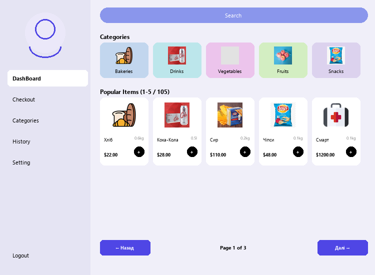
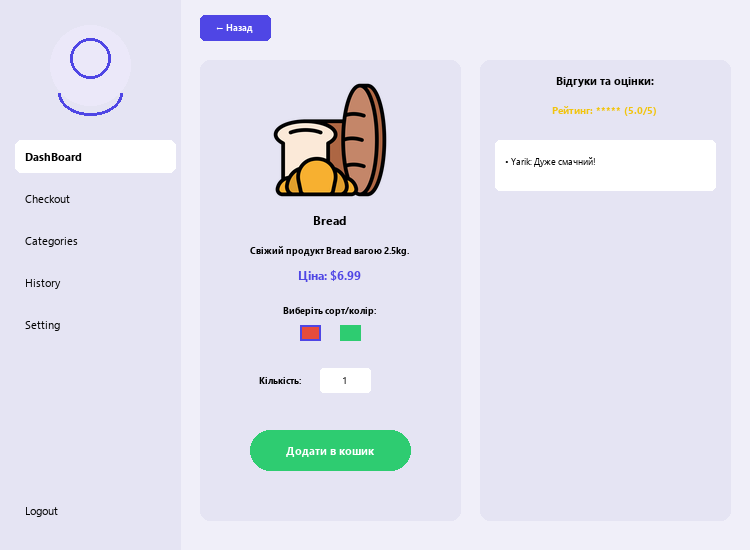
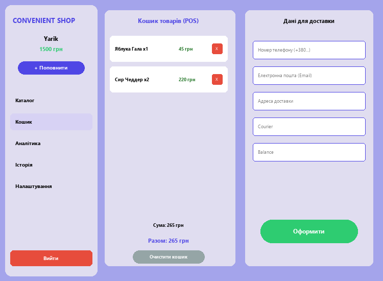
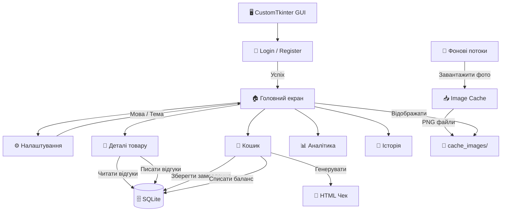

<div align="center">


# ✦ SILPO MARKETPLACE ✦
### *Твій персональний супермаркет прямо на робочому столі*

<br/>

[](https://python.org)
[](https://github.com/TomSchimansky/CustomTkinter)
[](https://sqlite.org)
[](LICENSE)
[](https://github.com/greenyarik0505-jpg/Privet)

<br/>

> 🌟 **504 реальних товари Сільпо** · **7 категорій** · **Замовлення з чеком** · **Аналітика** · **Відгуки**

</div>

---

<div align="center">

## 📸 Вигляд програми

</div>

| 🏠 Каталог | 📄 Деталі товару | 🛒 Кошик |
|:----------:|:----------------:|:--------:|
|  |  |  |
| *504 товари, 7 категорій, пошук в реальному часі* | *Опис, сорт/варіант, відгуки та рейтинг* | *Кошик з формою доставки та оплатою* |

---

<div align="center">

## ⚡ Ключові можливості

</div>

```
╔══════════════════════════════════════════════════════════════════╗
║  🛒  504 реальних товари Сільпо у 7 категоріях                   ║
║  🌍  3 мови: Українська · English · Русский                      ║
║  🎨  Темна та світла теми — перемикання в один клік              ║
║  ⚡  Пошук в реальному часі серед сотень товарів                  ║
║  📦  Завантаження зображень у фоні — без зависань                 ║
║  ⭐  Відгуки та рейтинги на кожен товар                           ║
║  🧾  HTML-чек після кожного замовлення                            ║
║  📊  Аналітика витрат та історія замовлень                        ║
║  💰  Гаманець з поповненням балансу                               ║
╚══════════════════════════════════════════════════════════════════╝
```

<br/>

<table>
<tr>
<td width="50%">

### 🛍️ Каталог та Пошук
- **504 реальних товари** з фото, цінами та описами
- Миттєвий пошук без затримок
- Фільтрація по 7 категоріях
- Пагінація по 15 товарів на сторінці

</td>
<td width="50%">

### 🔐 Авторизація
- Реєстрація та вхід через логін/пароль
- Дані зберігаються в локальній SQLite БД
- Авто-вхід через `session.txt`
- Видалення акаунту

</td>
</tr>
<tr>
<td width="50%">

### 🌍 Мови та Теми
- Перемикання між 🇺🇦 🇬🇧 🇷🇺 без перезапуску
- Темна 🌙 та світла ☀️ теми
- Все зберігається між сесіями

</td>
<td width="50%">

### 🧾 Замовлення та Чеки
- Форма доставки (телефон, email, адреса)
- Вибір доставки: Кур'єр / Нова Пошта
- Оплата балансом або карткою
- Генерація HTML чека після оплати

</td>
</tr>
</table>

---

<div align="center">

## 📦 Категорії товарів

</div>

<div align="center">

| Категорія | Назва | Приклади товарів |
|:---------:|:-----:|:-----------------|
| 🥖 | **Випічка** | Хліб подовий, Батон, Булочки, Круасани, Лаваш |
| 🥛 | **Молочні** | Молоко, Сир, Йогурт, Масло, Сметана |
| 🥩 | **М'ясо & Риба** | Куряче філе, Яловичина, Форель, Ковбаса |
| 🍎 | **Фрукти & Овочі** | Яблука, Банани, Томати, Огірки, Морква |
| 🛒 | **Бакалія** | Крупи, Макарони, Консерви, Олія, Борошно |
| 🍫 | **Снеки** | Чіпси, Горішки, Шоколад, Жуйка, Батончики |
| 🥤 | **Напої** | Сік, Вода, Кола, Енергетики, Чай |

</div>

---

<div align="center">

## ⚙️ Архітектура системи

</div>



---

<div align="center">

## 🛠️ Технологічний стек

</div>

<div align="center">

| Бібліотека | Версія | Призначення |
|:----------:|:------:|:-----------:|
|  | 3.8+ | Основна мова |
|  | Latest | Сучасний GUI |
|  | 10.0+ | Обробка зображень |
|  | Built-in | База даних |
|  | Built-in | Фоновий завантажувач |
|  | Built-in | HTTP запити |

</div>

---

<div align="center">

## 🚀 Встановлення та Запуск

</div>

**1. Клонуй репозиторій:**
```bash
git clone https://github.com/greenyarik0505-jpg/Privet.git
cd Privet
```

**2. Встанови залежності:**
```bash
pip install customtkinter pillow
```

**3. Запусти:**
```bash
python main.py
```

> ✅ При першому запуску зображення завантажаться автоматично у фоні.

---

<div align="center">

## 📖 Інструкція користувача

</div>

<details>
<summary><b>👤 Реєстрація та вхід</b></summary>

- Запусти `main.py`
- Натисни **Реєстрація** → введи логін та пароль → **Зареєструватися**
- Або **Увійти** якщо вже є акаунт
- При наступному запуску вхід буде автоматичним

</details>

<details>
<summary><b>🛍️ Пошук та покупки</b></summary>

- Введи назву товару в поле **"Пошук продуктів..."** — результати оновлюються миттєво
- Клікни на категорію щоб відфільтрувати товари
- Натисни **"+"** або **"-"** щоб змінити кількість, потім **"+ Додати"**
- Або відкрий картку товару для детального перегляду та відгуків

</details>

<details>
<summary><b>🧾 Оформлення замовлення</b></summary>

- Перейди в **Кошик** у лівому меню
- Перевір товари та загальну суму
- Заповни: телефон (+380...), email, адресу доставки
- Вибери спосіб доставки та оплати
- Натисни **"Оформити замовлення"** — HTML чек збережеться у папці проєкту

</details>

<details>
<summary><b>⚙️ Налаштування</b></summary>

- **Налаштування** → вибір мови (🇺🇦 / 🇬🇧 / 🇷🇺)
- Перемикач теми: **Темна 🌙** або **Світла ☀️**
- **"+ Поповнити"** → додати 500 грн до балансу

</details>

---

<div align="center">

## 💻 Схема бази даних

</div>

```sql
-- Користувачі
CREATE TABLE users (
    username TEXT PRIMARY KEY,
    password TEXT NOT NULL,
    balance  INTEGER DEFAULT 1000
);

-- Відгуки та рейтинги
CREATE TABLE reviews (
    id           INTEGER PRIMARY KEY AUTOINCREMENT,
    product_name TEXT,
    username     TEXT,
    rating       INTEGER CHECK(rating BETWEEN 1 AND 5),
    text         TEXT
);

-- Замовлення
CREATE TABLE orders (
    id          INTEGER PRIMARY KEY AUTOINCREMENT,
    username    TEXT,
    total       INTEGER,
    items_count INTEGER,
    date        TEXT
);
```

---

<div align="center">

## 📊 Таблиця функцій

| Функція | Статус | Деталі |
|:--------|:------:|:-------|
| 504 реальних товари Сільпо | ✅ | 7 категорій |
| Завантаження зображень у фоні | ✅ | Кеш у `cache_images/` |
| Реєстрація та вхід | ✅ | SQLite, авто-сесія |
| 3 мови (UA / EN / RU) | ✅ | Миттєве перемикання |
| Темна / Світла тема | ✅ | Динамічне перемикання |
| Пошук в реальному часі | ✅ | 504 товари, без затримок |
| Відгуки та рейтинги | ✅ | На кожен товар окремо |
| Кошик та оформлення | ✅ | З формою доставки |
| HTML чек після оплати | ✅ | `receipt_*.html` |
| Поповнення балансу | ✅ | +500 грн за клік |
| Аналітика витрат | ✅ | Графіки і статистика |
| Історія замовлень | ✅ | Всі минулі покупки |

</div>

---

<div align="center">

## 🤝 Внесок у проєкт

Будемо раді pull request-ам!

1. Fork репозиторію
2. Створи гілку: `git checkout -b feature/MyFeature`
3. Зроби коміт: `git commit -m 'Add MyFeature'`
4. Запуш: `git push origin feature/MyFeature`
5. Відкрий Pull Request

---

<br/>

*Розроблено з ❤️ на Python · Дані з реального каталогу супермаркету Сільпо*

[](https://github.com/greenyarik0505-jpg/Privet)

</div>