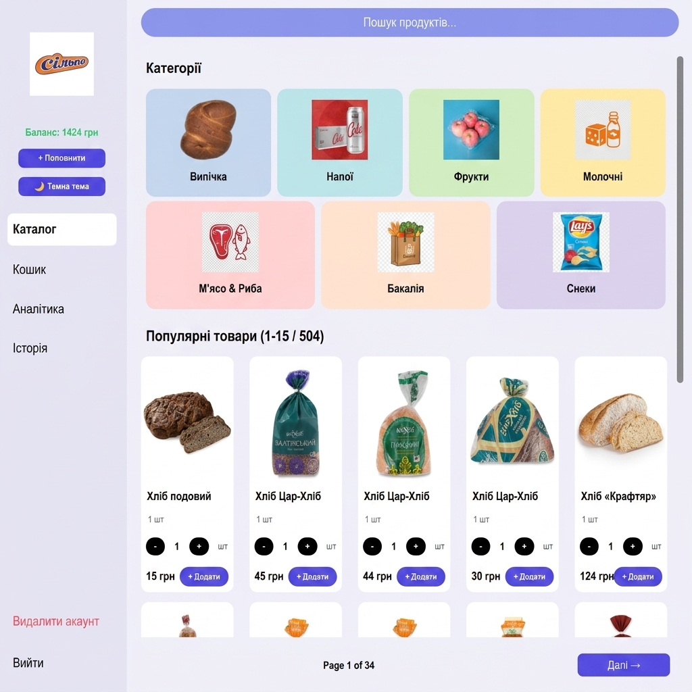
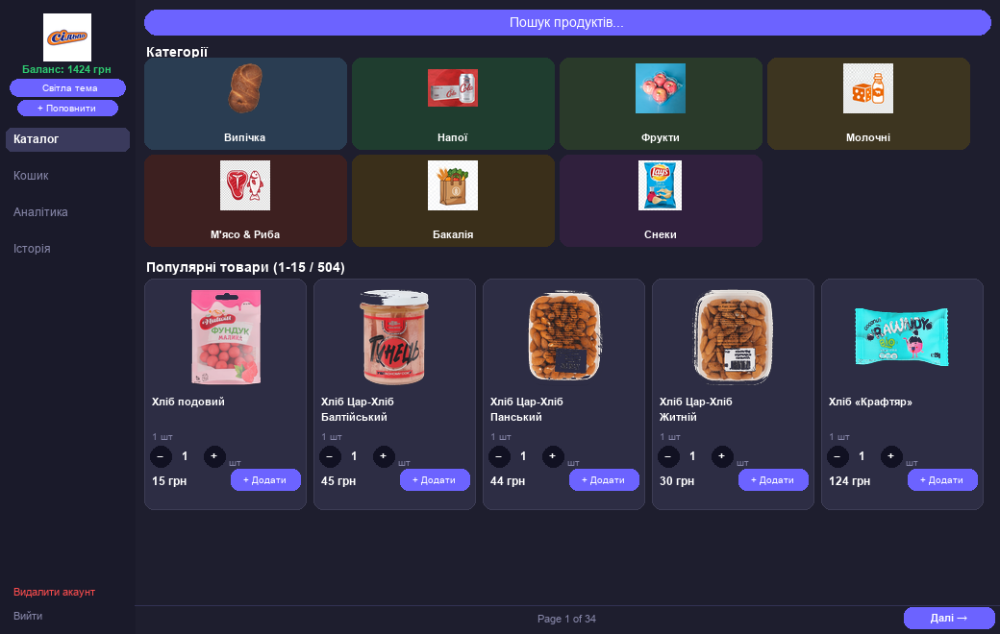
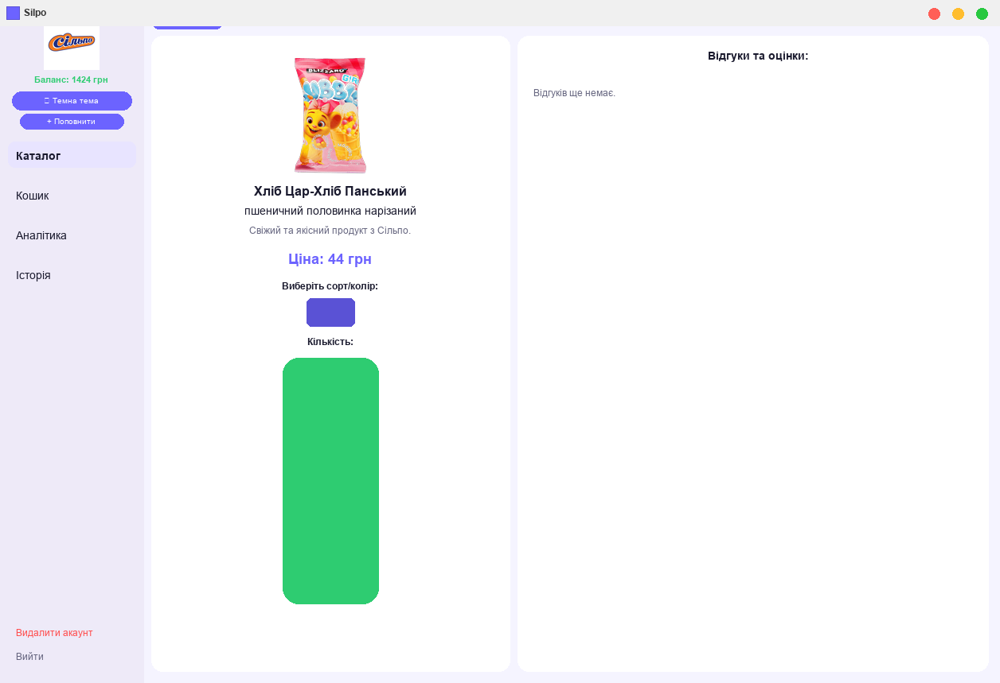
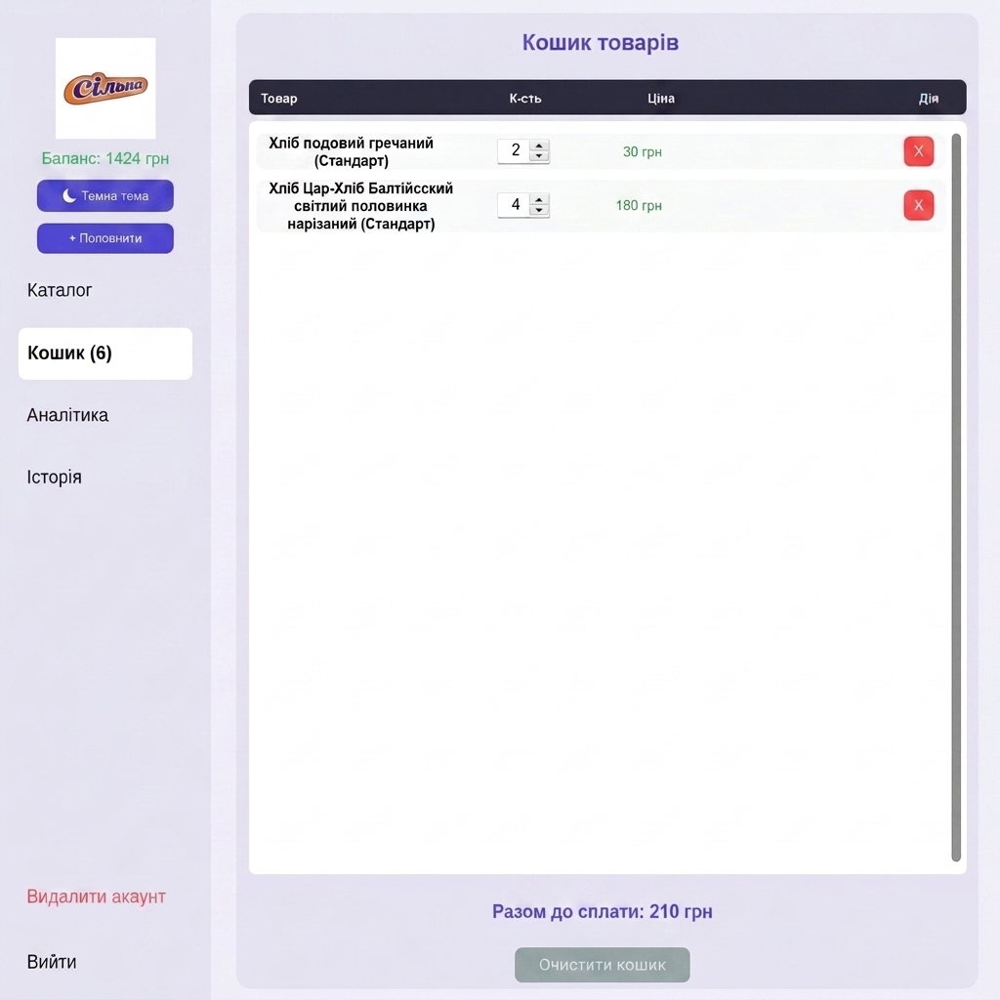
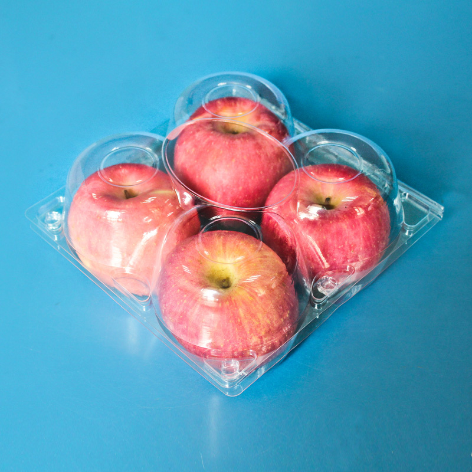
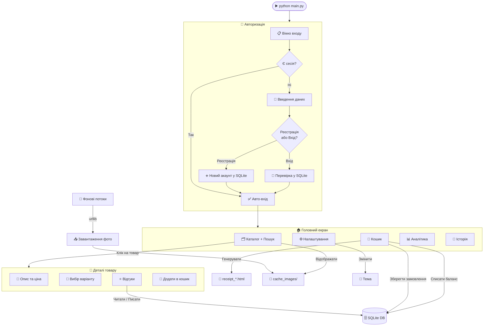

<div align="center">

<br/>


<br/><br/>

# ╔══════════════════════════════╗
# ║    ✦  SILPO MARKETPLACE  ✦   ║
# ╚══════════════════════════════╝

### *Повноцінний десктопний супермаркет — прямо на твоєму комп'ютері*

> [!IMPORTANT]
> **УВАГА:** Цей проєкт є **неофіційним навчальним симулятором** і створений виключно в освітніх та демонстраційних цілях. Проєкт **не є** офіційним застосунком мережі супермаркетів «Сільпо» (ТОВ «Фоззі-Фуд») та не пов'язаний з компанією. Всі торгові марки належать їхнім власникам.

<br/>

[](https://python.org)
[](https://github.com/TomSchimansky/CustomTkinter)
[](https://sqlite.org)
[](https://pillow.readthedocs.io)
[](LICENSE)
[](https://github.com/greenyarik0505-jpg/Privet/stargazers)
[](https://github.com/greenyarik0505-jpg/Privet/issues)

<br/>

```
  ████████████████████████████████████████████████████████████
  █                                                          █
  █   🛒  504 РЕАЛЬНИХ ТОВАРИ     📊  АНАЛІТИКА ВИТРАТ      █
  █   🎨  ТЕМНА / СВІТЛА ТЕМА    ⭐  ВІДГУКИ ТА РЕЙТИНГИ   █
  █   ⚡  ПОШУК БЕЗ ЗАТРИМОК     🧾  HTML ЧЕК ЗАМОВЛЕННЯ   █
  █   📦  ФОНОВИЙ ЗАВАНТАЖУВАЧ   💰  ГАМАНЕЦЬ БАЛАНСУ      █
  █   🔐  АВТОРИЗАЦІЯ            📜  ІСТОРІЯ ЗАМОВЛЕНЬ     █
  █                                                          █
  ████████████████████████████████████████████████████████████
```

<br/>

</div>

---

<div align="center">

## 📸 Вигляд програми

</div>

<br/>

### 🏠 Головний екран — Каталог товарів
> *504 реальних товари Сільпо з фотографіями, цінами та категоріями*



<br/>

### 🌙 Темна тема
> *Зручна для роботи у темряві — миттєве перемикання без перезапуску*



<br/>

### 📄 Детальна сторінка товару
> *Опис, вибір варіанту/сорту, кількість, відгуки покупців та рейтинг*



<br/>

### 🛒 Кошик та оформлення замовлення
> *Список товарів, підрахунок суми, форма доставки та оплати*



---

<div align="center">

## 📊 Статистика проєкту

</div>

<div align="center">

| 📦 Товарів | 🗂️ Категорій | 💾 Рядків коду | 🌍 Мови | 🎨 Тем |
|:----------:|:------------:|:--------------:|:-------:|:------:|
| **504** | **7** | **1900+** | **1 (UA)** | **2** |

</div>

---

<div align="center">

## ✨ Повний перелік можливостей

</div>

<br/>

### 🛍️ Каталог та Пошук

```
┌─────────────────────────────────────────────────────────────────┐
│  📦  504 реальних товари з фотографіями з сайту Сільпо          │
│  🔍  Пошук у реальному часі — результати з'являються при друці  │
│  🗂️  Фільтрація по 7 категоріях одним кліком                   │
│  📄  Пагінація: 15 товарів на сторінку, 34 сторінки каталогу   │
│  🖼️  Фото товарів завантажуються у фоні (без зависань)         │
│  💲  Ціни в гривнях, кількість одиниць виміру (шт/кг/л)        │
└─────────────────────────────────────────────────────────────────┘
```

<br/>

### 🔐 Авторизація та Акаунти

```
┌─────────────────────────────────────────────────────────────────┐
│  👤  Реєстрація: унікальний логін + пароль                      │
│  🔑  Вхід з перевіркою облікових даних                          │
│  💾  Авто-збереження сесії у файл (session.txt)                 │
│  🔄  Автоматичний вхід при наступному запуску                   │
│  🗑️  Видалення акаунту з підтвердженням                        │
│  💰  Стартовий баланс гаманця для нових користувачів            │
└─────────────────────────────────────────────────────────────────┘
```

<br/>

### 🎨 Теми оформлення

```
┌─────────────────────────────────────────────────────────────────┐
│  ☀️  Світла тема — мінімалістичний лавандовий дизайн            │
│  🌙  Темна тема — зручна для роботи у темряві                   │
│  ⚡  Перемикання миттєве — без перезавантаження                  │
└─────────────────────────────────────────────────────────────────┘
```

<br/>

### ⭐ Відгуки та Рейтинги

```
┌─────────────────────────────────────────────────────────────────┐
│  ⭐  Рейтинг від 1 до 5 зірок для кожного товару               │
│  💬  Текстовий коментар разом з оцінкою                         │
│  📊  Середній рейтинг оновлюється після кожного відгуку          │
│  👤  Відгуки прив'язані до облікового запису                    │
│  📋  Всі відгуки зберігаються в SQLite                          │
└─────────────────────────────────────────────────────────────────┘
```

<br/>

### 🧾 Замовлення та Чеки

```
┌─────────────────────────────────────────────────────────────────┐
│  📋  Кошик з переліком товарів та кількістю                     │
│  📱  Введення телефону (+380...)                                 │
│  📧  Email для підтвердження замовлення                          │
│  🏠  Адреса доставки                                             │
│  🚚  Вибір доставки: Кур'єр / Нова Пошта / Самовивіз           │
│  💳  Оплата: Балансом акаунту / Карткою при доставці            │
│  🧾  HTML чек зберігається як receipt_*.html                    │
└─────────────────────────────────────────────────────────────────┘
```

<br/>

### 📊 Аналітика та Історія

```
┌─────────────────────────────────────────────────────────────────┐
│  📈  Загальна сума витрат за всі замовлення                      │
│  🛒  Кількість здійснених замовлень                              │
│  📅  Дата та час кожного замовлення                              │
│  💰  Поточний баланс гаманця                                     │
│  📜  Повна історія замовлень у хронологічному порядку           │
└─────────────────────────────────────────────────────────────────┘
```

---

<div align="center">

## 📦 Категорії товарів

</div>

<br/>

<table align="center">
<tr>
<td align="center" width="14%">
<br/>
<b>🥖 Випічка</b><br/>
<sub>Хліб, Батони<br/>Булочки, Лаваш<br/>Круасани, Багет</sub>
</td>
<td align="center" width="14%">
<br/>
<b>🥛 Молочні</b><br/>
<sub>Молоко, Кефір<br/>Сир, Йогурт<br/>Масло, Сметана</sub>
</td>
<td align="center" width="14%">
<br/>
<b>🥩 М'ясо & Риба</b><br/>
<sub>Куряче філе<br/>Яловичина<br/>Форель, Ковбаса</sub>
</td>
<td align="center" width="14%">
<br/>
<b>🍎 Фрукти</b><br/>
<sub>Яблука, Банани<br/>Помідори, Огірки<br/>Морква, Картопля</sub>
</td>
<td align="center" width="14%">
<br/>
<b>🛒 Бакалія</b><br/>
<sub>Крупи, Макарони<br/>Консерви, Олія<br/>Борошно, Цукор</sub>
</td>
<td align="center" width="14%">
<br/>
<b>🍫 Снеки</b><br/>
<sub>Чіпси, Горішки<br/>Шоколад, Жуйка<br/>Батончики, Попкорн</sub>
</td>
<td align="center" width="14%">
<br/>
<b>🥤 Напої</b><br/>
<sub>Сік, Вода<br/>Кола, Енергетики<br/>Чай, Кава</sub>
</td>
</tr>
</table>

<br/>

<div align="center">

| # | Категорія | UA Назва | Кількість товарів | Одиниці |
|:-:|:---------:|:--------:|:-----------------:|:-------:|
| 1 | 🥖 Bakeries | Випічка | ~80 | шт / г |
| 2 | 🥛 Dairy | Молочні | ~70 | л / г / шт |
| 3 | 🥩 Meat & Fish | М'ясо & Риба | ~90 | кг / г / шт |
| 4 | 🍎 Fruits & Veg | Фрукти | ~85 | кг / шт |
| 5 | 🛒 Grocery | Бакалія | ~75 | кг / л / шт |
| 6 | 🍫 Snacks | Снеки | ~55 | г / шт |
| 7 | 🥤 Drinks | Напої | ~49 | л / мл / шт |
| | | **Разом** | **504** | |

</div>

---

<div align="center">

## ⚙️ Архітектура системи

</div>



---

<div align="center">

## 🛠️ Технологічний стек

</div>

<div align="center">

| Технологія | Призначення | Чому обрали |
|:----------:|:-----------:|:-----------:|
|  | Основна мова | Простий синтаксис, велика екосистема |
|  | GUI фреймворк | Сучасний вигляд, підтримка тем |
|  | База даних | Вбудована в Python, без сервера |
|  | Зображення | Завантаження та масштабування PNG |
|  | Фоновий завантажувач | Без зависання GUI |
|  | HTTP запити | Завантаження фото товарів |

</div>

---

<div align="center">

## 🚀 Встановлення та Запуск

</div>

### Крок 1 — Клонування репозиторію

```bash
git clone https://github.com/greenyarik0505-jpg/Privet.git
cd Privet
```

### Крок 2 — Встановлення залежностей

```bash
pip install customtkinter pillow
```

> **Примітка:** Python 3.8 або новіший є обов'язковим. SQLite3 та threading вже вбудовані в стандартну бібліотеку.

### Крок 3 — Запуск

```bash
python main.py
```

> ✅ При першому запуску зображення категорій та товарів завантажуються автоматично у фоні.
> ✅ Всі дані (акаунти, замовлення, відгуки) зберігаються у файлі `market.db`.

### Структура файлів

```
Privet/
│
├── main.py                    # 🚀 Головний файл застосунку (1900+ рядків)
├── market_db.py               # 🗄️ Менеджер бази даних SQLite
├── silpo_products.py          # 📦 Каталог 504 товарів Сільпо
├── market.db                  # 💾 SQLite база даних (генерується автоматично)
├── session.txt                # 👤 Збережена сесія користувача
│
├── assets/                    # 🖼️ Зображення
│   ├── silpo_logo.png         # Логотип Сільпо
│   ├── cat_icon.png           # 🎨 Кольорова іконка Каталогу
│   ├── cart_icon.png          # 🎨 Кольорова іконка Кошика
│   ├── analytics_icon.png     # 🎨 Кольорова іконка Аналітики
│   ├── history_icon.png       # 🎨 Кольорова іконка Історії
│   ├── settings_icon.png      # 🎨 Кольорова іконка Налаштувань
│   ├── logout_icon.png        # 🎨 Кольорова іконка Виходу
│   └── default.png            # Заглушка для відсутніх фото
│
├── cache_images/              # 📥 Кеш завантажених фото товарів
├── receipt_*.html             # 🧾 Згенеровані HTML чеки замовлень
│
├── screenshot_main_v7.png     # 📷 Скріншот головного екрану (світла тема)
├── screenshot_dark_v7.png     # 📷 Скріншот каталогу (темна тема)
├── screenshot_details_v7.png  # 📷 Скріншот деталей товару
└── screenshot_cart_v7.png     # 📷 Скріншот кошика
```

---

<div align="center">

## 📖 Повна інструкція користувача

</div>

<details>
<summary><b>👤 Реєстрація нового акаунту</b></summary>
<br/>

1. Запусти `python main.py`
2. На стартовому екрані натисни **"Реєстрація"**
3. Введи **логін** (унікальне ім'я) та **пароль**
4. Натисни **"Зареєструватися"**
5. При успішній реєстрації відкриється головний екран
6. При наступному запуску вхід буде **автоматичним** (завдяки `session.txt`)

</details>

<details>
<summary><b>🔑 Вхід в існуючий акаунт</b></summary>
<br/>

1. Запусти `python main.py`
2. Введи свій **логін** та **пароль**
3. Натисни **"Увійти"**
4. Якщо дані правильні — відкриється каталог товарів
5. Щоб вийти з акаунту — натисни **"Вийти"** внизу лівого меню

</details>

<details>
<summary><b>🔍 Пошук та перегляд товарів</b></summary>
<br/>

**Пошук:**
- Введи назву товару у верхнє поле **"Пошук продуктів..."**
- Результати оновлюються **миттєво** без натискання Enter
- Очисти поле щоб повернутися до повного каталогу

**Фільтрація по категоріям:**
- Клікни на будь-яку плитку категорії (Випічка, Напої, тощо)
- Каталог автоматично покаже лише товари цієї категорії

**Перегляд деталей:**
- Клікни на картку товару щоб відкрити детальну сторінку
- Побачиш опис, ціну, фото, вибір варіанту та відгуки

**Навігація:**
- Кнопки **"← Назад"** та **"Далі →"** для переходу між сторінками
- В каталозі відображається: `Page X of Y`

</details>

<details>
<summary><b>🛒 Додавання товарів до кошика</b></summary>
<br/>

**Спосіб 1 — З каталогу:**
- Натисни **"−"** або **"+"** для зміни кількості
- Натисни **"+ Додати"** — товар додається до кошика

**Спосіб 2 — З детальної сторінки:**
- Відкрий сторінку товару
- Вибери варіант/сорт (якщо доступно)
- Встанови кількість за допомогою спінера
- Натисни **"Додати в кошик"**

</details>

<details>
<summary><b>🧾 Оформлення замовлення</b></summary>
<br/>

1. Перейди до **"Кошик"** у лівому меню
2. Перевір список товарів та загальну суму
3. Заповни форму доставки:
   - 📱 Номер телефону (+380...)
   - 📧 Email адреса
   - 🏠 Адреса доставки
   - 🚚 Спосіб доставки (Кур'єр / Нова Пошта / Самовивіз)
   - 💳 Спосіб оплати (Балансом / Карткою)
4. Натисни **"Оформити замовлення"**
5. HTML чек збережеться у папці проєкту як `receipt_*.html`

</details>

<details>
<summary><b>⭐ Відгуки та рейтинги</b></summary>
<br/>

1. Відкрий детальну сторінку будь-якого товару
2. Прокрути вниз до розділу **"Відгуки та оцінки"**
3. Вибери оцінку (1–5 зірок) через спінер
4. Введи текст відгуку у поле
5. Натисни **"Надіслати"**
6. Середній рейтинг товару оновиться одразу

</details>

<details>
<summary><b>⚙️ Налаштування програми</b></summary>
<br/>

Перейди до **"Налаштування"** у лівому меню:

| Опція | Варіанти | Ефект |
|-------|----------|-------|
| 🎨 Тема | Світла / Темна | Змінює кольорову схему |
| 💰 Поповнити | +500 грн | Додає баланс до гаманця |

</details>

<details>
<summary><b>📊 Аналітика та Історія</b></summary>
<br/>

**Аналітика:**
- Перейди до розділу **"Аналітика"**
- Побачиш загальну суму витрат та кількість замовлень

**Історія:**
- Перейди до розділу **"Історія"**
- Переглядай всі минулі замовлення з датами та сумами

</details>

---

<div align="center">

## 💻 Схема бази даних

</div>

```sql
-- ════════════════════════════════════════
-- ТАБЛИЦЯ КОРИСТУВАЧІВ
-- ════════════════════════════════════════
CREATE TABLE IF NOT EXISTS users (
    username TEXT PRIMARY KEY,        -- Унікальний логін
    password TEXT    NOT NULL,        -- Пароль
    balance  INTEGER DEFAULT 1000     -- Баланс гаманця (грн)
);

-- ════════════════════════════════════════
-- ТАБЛИЦЯ ВІДГУКІВ ТА РЕЙТИНГІВ
-- ════════════════════════════════════════
CREATE TABLE IF NOT EXISTS reviews (
    id           INTEGER PRIMARY KEY AUTOINCREMENT,
    product_name TEXT    NOT NULL,              -- Назва товару
    username     TEXT    NOT NULL,              -- Автор відгуку
    rating       INTEGER CHECK(rating BETWEEN 1 AND 5),  -- Оцінка 1-5
    text         TEXT                           -- Текст відгуку
);

-- ════════════════════════════════════════
-- ТАБЛИЦЯ ЗАМОВЛЕНЬ
-- ════════════════════════════════════════
CREATE TABLE IF NOT EXISTS orders (
    id          INTEGER PRIMARY KEY AUTOINCREMENT,
    username    TEXT    NOT NULL,    -- Покупець
    total       INTEGER NOT NULL,    -- Загальна сума (грн)
    items_count INTEGER NOT NULL,    -- Кількість позицій
    date        TEXT    NOT NULL     -- Дата та час замовлення
);
```

---

<div align="center">

## 📊 Повна таблиця функцій

</div>

<div align="center">

| # | Функція | Статус | Деталі |
|:-:|:--------|:------:|:-------|
| 1 | 📦 Каталог 504 товарів Сільпо | ✅ Готово | Реальні назви, ціни, фото, одиниці виміру |
| 2 | 🖼️ Фоновий завантажувач фото | ✅ Готово | `threading` + кеш у `cache_images/` |
| 3 | 🔐 Реєстрація та вхід | ✅ Готово | SQLite, авто-збереження сесії |
| 4 | 🎨 Кольорові PNG іконки сайдбару | ✅ Готово | Преміальні кольорові іконки замість емодзі |
| 5 | 🎨 Темна / Світла тема | ✅ Готово | CustomTkinter appearance mode |
| 6 | 🔍 Пошук у реальному часі | ✅ Готово | Серед 504 товарів без затримок |
| 7 | 🗂️ Фільтрація по категоріям | ✅ Готово | 7 категорій, одним кліком |
| 8 | 📄 Детальна сторінка товару | ✅ Готово | Фото, опис, варіант, кількість |
| 9 | ⭐ Відгуки та рейтинги | ✅ Готово | 1–5 зірок + текст, SQLite |
| 10 | 🛒 Кошик товарів | ✅ Готово | Редагування кількості, видалення |
| 11 | 🧾 Форма та HTML чек | ✅ Готово | Доставка + оплата + `receipt_*.html` |
| 12 | 💰 Гаманець + поповнення | ✅ Готово | Відображення балансу, +500 грн |
| 13 | 📊 Аналітика витрат | ✅ Готово | Загальна сума та кількість |
| 14 | 📜 Історія замовлень | ✅ Готово | Хронологічний список |
| 15 | 🗑️ Видалення акаунту | ✅ Готово | З підтвердженням |
| 16 | 📄 Пагінація каталогу | ✅ Готово | 15 товарів / 34 сторінки |
| 17 | 🧪 Unit тести | ❌ Заплановано | Планується у `tests/` |
| 18 | 🚀 CI/CD | ❌ Заплановано | GitHub Actions |

</div>

---

<div align="center">

## 🗺️ Дорожня карта

</div>

```
✅ Версія 1.0  ──  Базовий каталог фруктів (перша версія)
✅ Версія 2.0  ──  500+ товарів, SQLite, авторизація, замовлення
✅ Версія 3.0  ──  7 категорій Сільпо, 504 реальних товари
✅ Поточна     ──  CustomTkinter UI, аналітика, повний README

🔄 Наступне:
   ├── 📱 Мобільний адаптивний розмір вікна
   ├── 🔔 Push-сповіщення про акції
   ├── ❤️  Список обраних товарів (Wishlist)
   ├── 🏷️  Система знижок та промокодів
   └── 🧪 Unit тести
```

---

<div align="center">

## 🤝 Внесок у проєкт

</div>

Будемо раді будь-яким покращенням!

```bash
# 1. Форкни репозиторій через GitHub UI

# 2. Клонуй свій форк
git clone https://github.com/YOUR_USERNAME/Privet.git
cd Privet

# 3. Створи нову гілку
git checkout -b feature/MyAwesomeFeature

# 4. Внеси зміни та зроби коміт
git add .
git commit -m "✨ Add MyAwesomeFeature"

# 5. Запуш та відкрий Pull Request
git push origin feature/MyAwesomeFeature
```

### Типи внесків

| Тип | Опис |
|-----|------|
| 🐛 Bug fix | Виправлення помилок |
| ✨ New feature | Нові функції |
| 📖 Docs | Покращення документації |
| 🎨 UI | Покращення інтерфейсу |
| ⚡ Performance | Оптимізація продуктивності |

---

<div align="center">

## 📄 Ліцензія

Цей проєкт розповсюджується під ліцензією **MIT**.
Деталі — у файлі [LICENSE](LICENSE).

---

<br/>

*Розроблено з ❤️ на Python · Навчальний симулятор з використанням даних каталогу Сільпо (проєкт є неофіційним)*

<br/>

[](https://github.com/greenyarik0505-jpg/Privet)
[](https://python.org)

<br/>

⭐ *Якщо проєкт сподобався — постав зірочку на GitHub!* ⭐

</div>