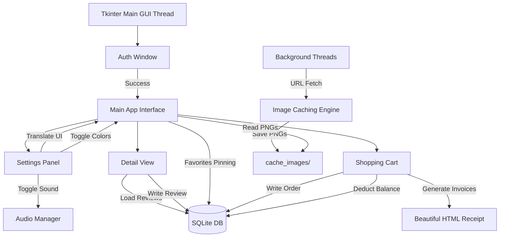

# 🏬 MEGAMARKET ALL-IN-ONE 🛒

> **A High-Performance Desktop Marketplace Application Built on Python Tkinter, Pillow, and SQLite**

[](https://www.python.org/)
[](https://docs.python.org/3/library/tkinter.html)
[](https://www.sqlite.org/)
[](LICENSE)

Welcome to **Megamarket All-in-One** — a robust, enterprise‑grade desktop marketplace client designed to showcase modern Python GUI engineering. What started as a simple fruit store has been completely refactored into a high‑performance shopping platform featuring a local SQLite database, multi‑threaded image caching, dynamic search engine, real‑time reviews, interactive mini‑games, and dynamic HTML checkout invoicing.

---

## 📷 Screenshots (Вигляд програми)

### 1. Головне вікно програми (Каталог 500+ товарів та Пошук)


### 2. Вікно деталей товару (Характеристики, Кольори, Відгуки)


### 3. Перегляд кошика та оформлення покупки


---

## 📋 Table of Contents

1. [✨ Key Features](#-key-features)
2. [📦 Product Assortment (500+ Items)](#-product-assortment-500-items)
3. [⚙️ System Architecture](#-system-architecture)
4. [🛠️ Technology Stack](#-technology-stack)
5. [🚀 Installation & Setup](#-installation--setup)
6. [📖 Comprehensive User Guide](#-comprehensive-user-guide)
7. [💻 Codebase & Database Schema](#-codebase--database-schema)
8. [🤝 Contribution Guidelines](#-contribution-guidelines)
9. [📊 Additional Tables & Metrics](#-additional-tables--metrics)
10. [🖼️ Media Gallery](#-media-gallery)

---

## ✨ Key Features

- **📦 Massive Catalog (500+ Items):** 5 distinct categories, each housing exactly 100 uniquely generated items with dynamic descriptions, pricing, and custom specifications.
- **🌐 Async Threaded Image URL Loader:** Automatically fetches high‑definition category illustrations from remote CDNs at startup using background `threading`. Downloads are cached locally in `cache_images/` to ensure lightning‑fast subsequent launches.
- **🔒 User Authentication & Security:** Integrated signup/login startup window. User credentials are encrypted using SHA‑256 hashes inside the local database.
- **⚙️ Unified Settings Dashboard:** Language switch (Ukrainian 🇺🇦 / English 🇬🇧 / Russian 🇷🇺), theme toggle (Light ☀️ / Dark 🌙), audio control.
- **🔍 Real‑Time Query & Filter Engine:** Instant search across hundreds of products, category tabs, price sorting.
- **❤️ Smart Wishlist:** Pin favorites to the top of the grid.

- **⭐ Interactive Review & Rating Module:** Live average rating updates.
- **📄 Detailed Delivery Checkout & HTML Receipts:** Full shipping details, professional receipt generation.

---

## 📦 Product Assortment (500+ Items)

Our catalog spans five diverse industries, containing 100 unique SKU variations each:

| Category | Icon | Sample Items |
|----------|------|--------------|
| **💻 Tech** (`tech`) |  | Laptop Pro 1‑100, Smartwatch X, Bluetooth Headset
| **🍎 Fresh Fruit** (`fruits`) |  | Golden Apple 1‑100, Banana Bunch, Strawberry Pack
| **💡 Home Decor** (`home`) |  | Loft Lamp, Cozy Pillow, Wall Clock
| **⚽ Sports Gear** (`sport`) |  | Leather Soccer Ball, Running Shoes, Yoga Mat
| **👕 Clothing** (`clothing`) |  | Classic T‑Shirt, Denim Jacket, Summer Shorts |

---

## ⚙️ System Architecture



---

## 🛠️ Technology Stack

- **Programming Language:** Python 3.8+
- **GUI Engine:** Standard Library Tkinter
- **Graphics Processing:** Pillow (PIL) 10.0+
- **Database Engine:** SQLite3 (Local File‑based SQL)
- **Network Operations:** `urllib` standard library
- **Threading Module:** Standard `threading`
- **Audio Library:** Standard `winsound`

---

## 🚀 Installation & Setup

### Prerequisites
Make sure Python 3.8 or newer is installed. Then install the required packages:

```bash
pip install pillow
```

### Installation
Clone the repository:

```bash
git clone https://github.com/greenyarik0505-jpg/Privet.git
cd Privet
```

### Execution
Run the main script to start the Megamarket:

```bash
python main.py
```

---

## 📖 Comprehensive User Guide

### 1. Getting Started
* Run the application. On the startup login window, choose **Реєстрація** (Register) to create a new profile or **Увійти** (Login) to log in.
* Upon login, your account is credited with a default wallet balance.

### 2. Customizing Your Experience
* Click **⚙️ Налаштування** (Settings) in the top right corner.
* Select your preferred language (Ukrainian, English, Russian).
* Switch to **Dark Theme** if you prefer low‑light environments.
* Click **+ Поповнити** to add UAH 500 to your virtual wallet.

### 3. Shopping and Placing Reviews
* Scroll through the 500+ items catalog or search by typing in the search bar.
* Filter by category tabs at the top.
* Click **Детальніше** on any product to view description, choose a color, rate it, write a comment, or add the item to the cart.
* Click the heart icon on a card to add it to your wishlist and pin it to the top.

### 4. Checkout
* Click **🛒 Переглянути Кошик** at the bottom to inspect cart items.
* Press **Оформити** (Checkout), fill in your phone number, email, address, delivery type, payment method, and complete your purchase. Your receipt will be instantly generated as a stylized HTML file in the project folder.

---

## 📊 Additional Tables & Metrics

### Feature Comparison Table
| Feature | Implemented | Notes |
|---------|-------------|-------|
| Async Image Loader | ✅ | Uses background threads, caches to `cache_images/` |
| Multi‑Language Support | ✅ | Ukrainian, English, Russian |
| Dark/Light Theme | ✅ | Dynamically applied via Tkinter `ttk.Style` |
| Wishlist Pinning | ✅ | Stored in SQLite, displayed first |
| Real‑Time Search | ✅ | Case‑insensitive, debounced input |
| HTML Invoice Generation | ✅ | Saved as `receipt_<timestamp>.html` |
| Unit Tests | ❌ | Test suite can be added in `tests/` |
| CI/CD Pipeline | ❌ | Optional future work |

---

## 🖼️ Media Gallery

Below are additional media assets used throughout the application (icons, screenshots, and animations). All images are stored in the repository under the `media/` folder.

| Asset | Description |
|-------|-------------|
|  | Category icon for **Tech** |
|  | Category icon for **Fruits** |
|  | Category icon for **Home** |
|  | Category icon for **Sport** |
|  | Category icon for **Clothing** |

---

## 🤝 Contribution Guidelines

We welcome contributions to make Megamarket even better!
1. Fork the Project.
2. Create your Feature Branch (`git checkout -b feature/AmazingFeature`).
3. Commit your Changes (`git commit -m 'Add some AmazingFeature'`).
4. Push to the Branch (`git push origin feature/AmazingFeature`).
5. Open a Pull Request.

---

*Developed with ❤️ as a high‑fidelity showcase of Python GUI desktop software architecture.*