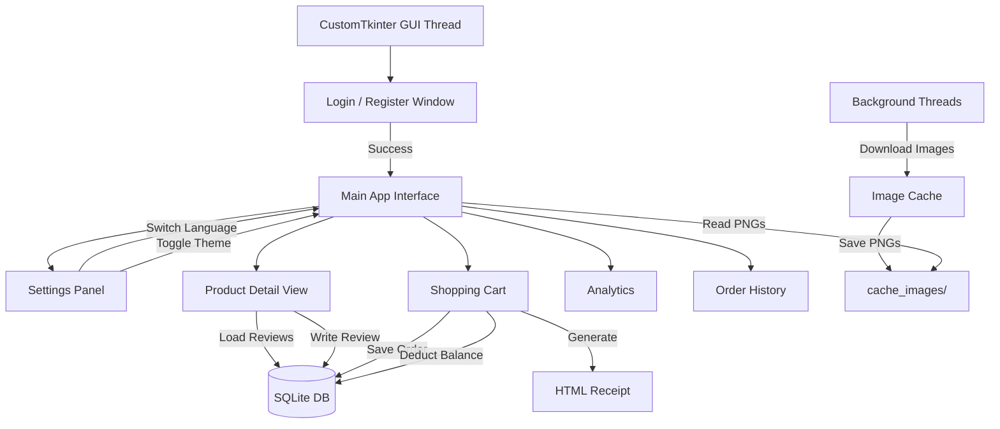

# 🏬 Silpo Marketplace 🛒

> **A Desktop Marketplace Application Built on Python CustomTkinter, Pillow, and SQLite**

[](https://www.python.org/)
[](https://github.com/TomSchimansky/CustomTkinter)
[](https://www.sqlite.org/)
[](LICENSE)

Welcome to **Silpo Marketplace** — a desktop supermarket app built with Python, featuring a real product catalog of 504 items across 7 categories, threaded image loading, user authentication, reviews, and HTML checkout receipts.

---

## 📷 Screenshots

### 1. Головне вікно — Каталог 504 товарів


### 2. Деталі товару — Опис, сорт, відгуки


### 3. Кошик та оформлення замовлення


---

## 📋 Table of Contents

1. [✨ Key Features](#-key-features)
2. [📦 Product Categories](#-product-categories)
3. [⚙️ System Architecture](#-system-architecture)
4. [🛠️ Technology Stack](#-technology-stack)
5. [🚀 Installation & Setup](#-installation--setup)
6. [📖 User Guide](#-user-guide)
7. [💻 Database Schema](#-database-schema)
8. [📊 Feature Table](#-feature-table)
9. [🤝 Contribution Guidelines](#-contribution-guidelines)

---

## ✨ Key Features

- **📦 Real Catalog (504 Items):** 7 categories of real supermarket products with images, prices, and descriptions.
- **🌐 Threaded Image Loader:** Downloads and caches product/category images in `cache_images/` using background threads — no UI freezing.
- **🔒 User Authentication:** Register/login window. Accounts stored in local SQLite database.
- **🌍 Multi-Language Support:** Switch between Ukrainian 🇺🇦, English 🇬🇧, and Russian 🇷🇺 on the fly.
- **🎨 Dark / Light Theme:** Toggle between themes dynamically from the Settings panel.
- **🔍 Real-Time Search:** Instantly filters 504 products as you type.
- **⭐ Reviews & Ratings:** Submit star ratings and text reviews. Average rating updates live.
- **📄 Checkout & HTML Receipt:** Fill in delivery info (phone, email, address, courier type, payment) and get a generated HTML receipt saved locally.
- **📊 Analytics & History:** View your order history and spending analytics.
- **💰 Wallet Balance:** Top up your in-app balance and pay directly from it.

---

## 📦 Product Categories

The catalog contains **504 real Silpo supermarket products** across 7 categories:

| # | Category | 🇺🇦 Name | Items |
|---|----------|----------|-------|
| 1 | 🥖 Bakeries | Випічка | Bread, bagels, pastries |
| 2 | 🥛 Dairy | Молочні | Milk, cheese, yogurt |
| 3 | 🥩 Meat & Fish | М'ясо & Риба | Chicken, beef, fish fillets |
| 4 | 🍎 Fruits & Vegetables | Фрукти | Apples, bananas, tomatoes |
| 5 | 🛒 Grocery | Бакалія | Pasta, rice, canned goods |
| 6 | 🍫 Snacks | Снеки | Chips, nuts, chocolate |
| 7 | 🥤 Drinks | Напої | Juice, water, energy drinks |

---

## ⚙️ System Architecture



---

## 🛠️ Technology Stack

| Library | Purpose |
|---------|---------|
| **CustomTkinter** | Modern GUI framework |
| **Pillow (PIL)** | Image loading and resizing |
| **SQLite3** | Local database for users, orders, reviews |
| **urllib** | Downloading product images |
| **threading** | Background image loading |
| **Python 3.8+** | Core language |

---

## 🚀 Installation & Setup

### Prerequisites

```bash
pip install customtkinter pillow
```

### Clone & Run

```bash
git clone https://github.com/greenyarik0505-jpg/Privet.git
cd Privet
python main.py
```

---

## 📖 User Guide

### 1. Getting Started
- Run the app → **Реєстрація** to register a new account or **Увійти** to log in.
- Your account starts with a default wallet balance.

### 2. Settings
- Click **Налаштування** in the left sidebar.
- Switch language (Ukrainian / English / Russian).
- Toggle **Dark** or **Light** theme.
- Click **+ Поповнити** to top up your balance by UAH 500.

### 3. Shopping
- Browse the catalog or use the **search bar** to find products instantly.
- Click any category tile to filter by category.
- Click a product card to open **details**: see description, choose a variant, set quantity, read/write reviews, and add to cart.

### 4. Checkout
- Go to **Кошик** in the left sidebar to review cart items.
- Fill in: phone number, email, delivery address, delivery type (Кур'єр / Nova Poshta / Self-pickup), payment method.
- Click **Оформити замовлення** — an HTML receipt is saved to the project folder.

### 5. Analytics & History
- **Аналітика** — see total spending and order stats.
- **Історія** — browse past orders.

---

## 💻 Database Schema

```sql
CREATE TABLE IF NOT EXISTS users (
    username TEXT PRIMARY KEY,
    password TEXT,
    balance INTEGER DEFAULT 1000
);

CREATE TABLE IF NOT EXISTS reviews (
    id INTEGER PRIMARY KEY AUTOINCREMENT,
    product_name TEXT,
    username TEXT,
    rating INTEGER,
    text TEXT
);

CREATE TABLE IF NOT EXISTS orders (
    id INTEGER PRIMARY KEY AUTOINCREMENT,
    username TEXT,
    total INTEGER,
    items_count INTEGER,
    date TEXT
);
```

---

## 📊 Feature Table

| Feature | Status | Notes |
|---------|--------|-------|
| Real 504-item catalog | ✅ | 7 Silpo categories |
| Threaded image loading | ✅ | Cached in `cache_images/` |
| User authentication | ✅ | Register / Login / Logout |
| Multi-language (UA/EN/RU) | ✅ | Instant switch |
| Dark / Light theme | ✅ | Dynamic toggle |
| Product search | ✅ | Real-time, case-insensitive |
| Reviews & ratings | ✅ | Per-product, per-user |
| Cart & checkout | ✅ | With delivery form |
| HTML receipt | ✅ | Saved as `receipt_*.html` |
| Wallet balance | ✅ | Top-up & pay |
| Analytics | ✅ | Spending stats |
| Order history | ✅ | Past orders list |
| Unit Tests | ❌ | Planned |

---

## 🤝 Contribution Guidelines

1. Fork the Project.
2. Create your Feature Branch (`git checkout -b feature/AmazingFeature`).
3. Commit your Changes (`git commit -m 'Add some AmazingFeature'`).
4. Push to the Branch (`git push origin feature/AmazingFeature`).
5. Open a Pull Request.

---

*Developed with ❤️ as a Python GUI desktop showcase using real Silpo supermarket data.*