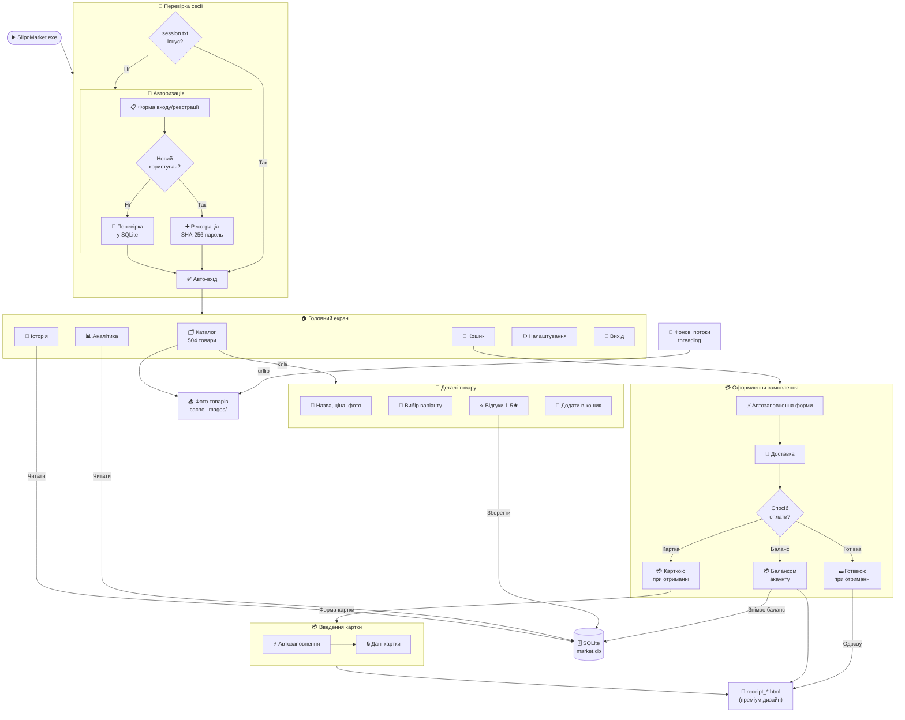
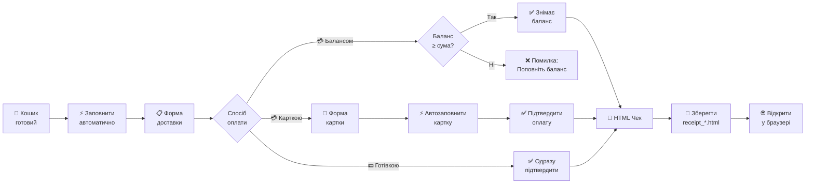
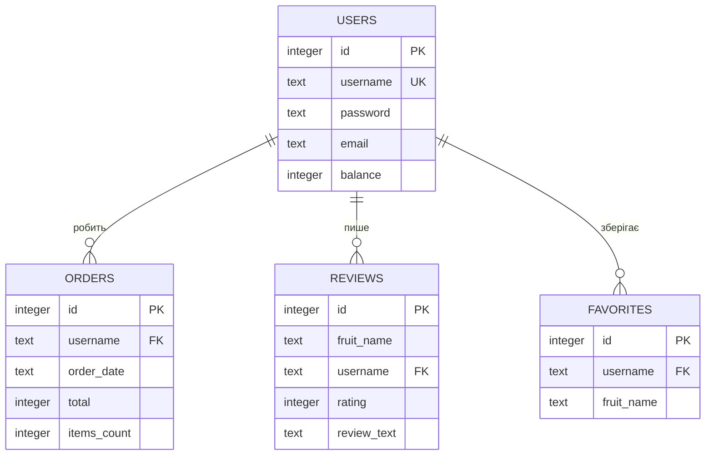
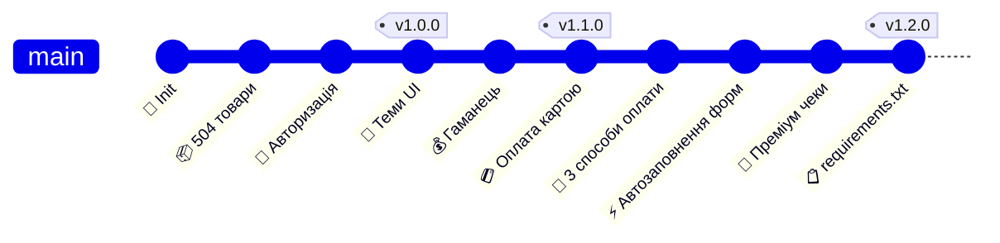

<div align="center">

<br/>


<br/><br/>

# 🛒 SILPO MARKET

### *Повноцінний десктопний супермаркет — прямо на твоєму комп'ютері*

> [!IMPORTANT]
> **УВАГА:** Цей проєкт є **неофіційним навчальним симулятором** і створений виключно в освітніх та демонстраційних цілях. Проєкт **не є** офіційним застосунком мережі супермаркетів «Сільпо» та не пов'язаний з компанією. Всі торгові марки належать їхнім власникам.

<br/>

[](https://python.org)
[](https://github.com/TomSchimansky/CustomTkinter)
[](https://sqlite.org)
[](https://pillow.readthedocs.io)
[](https://github.com/greenyarik0505-jpg/Privet/releases/latest)
[](LICENSE)
[](requirements.txt)
[](https://github.com/greenyarik0505-jpg/Privet/stargazers)

<br/>

```
  ╔══════════════════════════════════════════════════════════════╗
  ║                                                              ║
  ║   🛒  504 РЕАЛЬНИХ ТОВАРИ     📊  АНАЛІТИКА ВИТРАТ          ║
  ║   🎨  ТЕМНА / СВІТЛА ТЕМА    ⭐  ВІДГУКИ ТА РЕЙТИНГИ       ║
  ║   ⚡  ПОШУК БЕЗ ЗАТРИМОК     🧾  ПРЕМІУМ HTML ЧЕК          ║
  ║   📦  ФОНОВИЙ ЗАВАНТАЖУВАЧ   💰  ГАМАНЕЦЬ + ПОПОВНЕННЯ     ║
  ║   🔐  АВТОРИЗАЦІЯ + СЕСІЯ    💳  3 СПОСОБИ ОПЛАТИ          ║
  ║   ⚡  АВТОЗАПОВНЕННЯ ФОРМ    🚀  EXE БЕЗ ІНСТАЛЯЦІЇ        ║
  ║                                                              ║
  ╚══════════════════════════════════════════════════════════════╝
```

<br/>

</div>

---

<div align="center">

## 📸 Вигляд програми

</div>

<br/>

### 🏠 Головний екран — Каталог товарів
> *504 реальних товари Сільпо з фотографіями, цінами та категоріями*


<br/>

### 🌙 Темна тема
> *Зручна для роботи у темряві — миттєве перемикання без перезапуску*


<br/>

### 📄 Детальна сторінка товару
> *Опис, вибір варіанту/сорту, кількість, відгуки покупців та рейтинг*


<br/>

### 🛒 Кошик та оформлення замовлення
> *Список товарів, підрахунок суми, автозаповнення форми доставки та оплати*


---

<div align="center">

## 📊 Статистика проєкту

</div>

<div align="center">

| 📦 Товарів | 🗂️ Категорій | 💾 Рядків коду | 🌍 Мов інтерфейсу | 🎨 Тем | 💳 Способів оплати | 🚀 Версія |
|:----------:|:------------:|:--------------:|:-----------------:|:------:|:------------------:|:---------:|
| **504** | **7** | **2000+** | **1 (UA)** | **2** | **3** | **1.2.0** |

</div>

---

<div align="center">

## 🆕 Changelog

</div>

<details open>
<summary><b>🟢 v1.2.0 — Payment & UX Update (Поточна)</b></summary>
<br/>

| Тип | Зміна |
|:---:|-------|
| 🔧 | Виправлена логіка оплати: кожен метод працює незалежно |
| ✨ | Кнопка **⚡ Заповнити автоматично** у формі доставки |
| ✨ | Кнопка **⚡ Заповнити автоматично** у вікні оплати карткою |
| 🧾 | Повністю новий преміум дизайн HTML-чеків |
| 🔧 | Виправлено: баланс показував 0 після поповнення |
| 🔧 | Виправлено: вікно оплати тепер повністю відображається |
| 🗑️ | Видалено зайву кнопку «Поповнити 500 грн» з налаштувань |
| 📖 | Оновлено README |

</details>

<details>
<summary><b>🔵 v1.1.0 — Wallet & Topup</b></summary>
<br/>

| Тип | Зміна |
|:---:|-------|
| ✨ | Поповнення балансу на довільну суму |
| ✨ | Вікно банківської оплати FakePaymentWindow |
| 🔧 | Виправлено білі куточки логотипу в темній темі |

</details>

<details>
<summary><b>⚪ v1.0.0 — Initial Release</b></summary>
<br/>

| Тип | Зміна |
|:---:|-------|
| 🚀 | Перший публічний реліз |
| ✨ | 504 товари, SQLite, авторизація |
| ✨ | Темна/світла тема, пошук, аналітика |

</details>

---

<div align="center">

## ✨ Повний перелік можливостей

</div>

### 🛍️ Каталог та Пошук

| Функція | Деталі |
|---------|--------|
| 📦 504 товари | Реальні назви, ціни та фото з каталогу Сільпо |
| 🔍 Пошук у реальному часі | Результати миттєво при кожному символі |
| 🗂️ Фільтрація по категоріях | 7 категорій одним кліком |
| 📄 Пагінація | 15 товарів / сторінку, 34 сторінки |
| 🖼️ Фоновий завантажувач | `threading` — без зависань GUI |
| 💲 Одиниці виміру | шт / кг / л / г / мл |

### 🔐 Авторизація та Акаунти

| Функція | Деталі |
|---------|--------|
| 👤 Реєстрація | Унікальний логін + пароль (SHA-256) |
| 🔑 Вхід | Перевірка credentials у SQLite |
| 💾 Авто-збереження сесії | `session.txt` — автовхід при наступному запуску |
| 💰 Стартовий баланс | 1000 грн для кожного нового акаунту |
| 🗑️ Видалення акаунту | З підтвердженням + очистка всіх даних |

### 💳 Оплата — 3 способи

| Спосіб | Поведінка | Баланс |
|--------|-----------|--------|
| 💳 **Балансом акаунту** | Перевіряє баланс → знімає кошти → одразу підтверджує | ✅ Знімається |
| 💳 **Карткою при отриманні** | Відкриває форму введення картки | ❌ Не знімається |
| 💵 **Готівкою при отриманні** | Одразу підтверджує без додаткових вікон | ❌ Не знімається |

### 🧾 Замовлення та Чеки

| Функція | Деталі |
|---------|--------|
| ⚡ Автозаповнення доставки | Кнопка заповнює телефон, email, адресу одним кліком |
| ⚡ Автозаповнення картки | Кнопка заповнює номер картки, CVV, термін дії |
| 🚚 Вибір доставки | Кур'єр / Нова Пошта / Самовивіз |
| 🧾 HTML чек | Преміум дизайн з градієнтом, штрих-кодом, картками |
| 📂 Збереження чеку | `receipt_[user]_[date].html` у папці програми |

### 📊 Аналітика та Статистика

| Метрика | Опис |
|---------|------|
| 💸 Загальні витрати | Сума всіх замовлень |
| 🛒 Куплено товарів | Загальна кількість позицій |
| 📋 Середній чек | Середня сума одного замовлення |
| 📅 Історія | Хронологічний список з датами та сумами |

---

<div align="center">

## 📦 Категорії товарів

</div>

<br/>

<table align="center">
<tr>
<td align="center" width="14%">
<br/>
<b>🥖 Випічка</b><br/>
<sub>Хліб, Батони<br/>Булочки, Лаваш<br/>Круасани, Багет</sub>
</td>
<td align="center" width="14%">
<br/>
<b>🥛 Молочні</b><br/>
<sub>Молоко, Кефір<br/>Сир, Йогурт<br/>Масло, Сметана</sub>
</td>
<td align="center" width="14%">
<br/>
<b>🥩 М'ясо & Риба</b><br/>
<sub>Куряче філе<br/>Яловичина<br/>Форель, Ковбаса</sub>
</td>
<td align="center" width="14%">
<br/>
<b>🍎 Фрукти</b><br/>
<sub>Яблука, Банани<br/>Помідори, Огірки<br/>Морква, Картопля</sub>
</td>
<td align="center" width="14%">
<br/>
<b>🛒 Бакалія</b><br/>
<sub>Крупи, Макарони<br/>Консерви, Олія<br/>Борошно, Цукор</sub>
</td>
<td align="center" width="14%">
<br/>
<b>🍫 Снеки</b><br/>
<sub>Чіпси, Горішки<br/>Шоколад, Жуйка<br/>Батончики, Попкорн</sub>
</td>
<td align="center" width="14%">
<br/>
<b>🥤 Напої</b><br/>
<sub>Сік, Вода<br/>Кола, Енергетики<br/>Чай, Кава</sub>
</td>
</tr>
</table>

<br/>

<div align="center">

| # | Категорія | Назва (UA) | Кількість товарів | Одиниці виміру |
|:-:|:---------:|:----------:|:-----------------:|:--------------:|
| 1 | 🥖 Bakeries | Випічка | ~80 | шт / г |
| 2 | 🥛 Dairy | Молочні | ~70 | л / г / шт |
| 3 | 🥩 Meat & Fish | М'ясо & Риба | ~90 | кг / г / шт |
| 4 | 🍎 Fruits & Veg | Фрукти & Овочі | ~85 | кг / шт |
| 5 | 🛒 Grocery | Бакалія | ~75 | кг / л / шт |
| 6 | 🍫 Snacks | Снеки | ~55 | г / шт |
| 7 | 🥤 Drinks | Напої | ~49 | л / мл / шт |
| | | **Разом** | **504** | |

</div>

---

<div align="center">

## ⚙️ Архітектура системи

</div>



---

<div align="center">

## 💡 Потік оплати

</div>



---

<div align="center">

## 🛠️ Технологічний стек

</div>

<div align="center">

| Технологія | Версія | Призначення | Чому обрали |
|:----------:|:------:|:-----------:|:-----------:|
|  | 3.8+ | Основна мова | Простий синтаксис, велика екосистема |
|  | Latest | GUI фреймворк | Сучасний вигляд, підтримка тем |
|  | Built-in | База даних | Вбудована в Python, без сервера |
|  | Latest | Зображення | Завантаження та масштабування PNG |
|  | 6.x | Компіляція EXE | Один файл без залежностей |
|  | Built-in | Фоновий завантажувач | Без зависання GUI |
|  | Built-in | HTTP запити | Завантаження фото товарів |

</div>

---

<div align="center">

## 💾 Схема бази даних

</div>



```sql
-- ════════════════════════════════════════
-- ТАБЛИЦЯ КОРИСТУВАЧІВ
-- ════════════════════════════════════════
CREATE TABLE users (
    id       INTEGER PRIMARY KEY AUTOINCREMENT,
    username TEXT    UNIQUE NOT NULL,   -- Унікальний логін
    password TEXT    NOT NULL,          -- SHA-256 хеш паролю
    email    TEXT    DEFAULT '',        -- Email (для відновлення)
    balance  INTEGER DEFAULT 1000       -- Баланс гаманця (грн)
);

-- ════════════════════════════════════════
-- ТАБЛИЦЯ ЗАМОВЛЕНЬ
-- ════════════════════════════════════════
CREATE TABLE orders (
    id          INTEGER PRIMARY KEY AUTOINCREMENT,
    username    TEXT    NOT NULL,       -- Покупець
    order_date  TEXT    NOT NULL,       -- Дата та час (ISO)
    total       INTEGER NOT NULL,       -- Загальна сума (грн)
    items_count INTEGER NOT NULL        -- Кількість позицій
);

-- ════════════════════════════════════════
-- ТАБЛИЦЯ ВІДГУКІВ
-- ════════════════════════════════════════
CREATE TABLE reviews (
    id          INTEGER PRIMARY KEY AUTOINCREMENT,
    fruit_name  TEXT    NOT NULL,       -- Назва товару
    username    TEXT    NOT NULL,       -- Автор відгуку
    rating      INTEGER NOT NULL,       -- Оцінка 1–5 ★
    review_text TEXT    NOT NULL        -- Текст відгуку
);

-- ════════════════════════════════════════
-- ТАБЛИЦЯ ОБРАНОГО
-- ════════════════════════════════════════
CREATE TABLE favorites (
    id         INTEGER PRIMARY KEY AUTOINCREMENT,
    username   TEXT    NOT NULL,
    fruit_name TEXT    NOT NULL,
    UNIQUE(username, fruit_name)        -- Дублікати заборонені
);
```

---

<div align="center">

## 🚀 Встановлення та Запуск

</div>

### ⚡ Варіант 1 — Готовий EXE (рекомендовано)

> Завантаж **[SilpoMarket.exe](https://github.com/greenyarik0505-jpg/Privet/releases/latest)** і просто запусти — Python не потрібен!

### 🐍 Варіант 2 — З вихідного коду

```bash
# 1. Клонуй репозиторій
git clone https://github.com/greenyarik0505-jpg/Privet.git
cd Privet

# 2. Встанови всі залежності одною командою
pip install -r requirements.txt

# 3. Запусти
python main.py
```

#### 📦 Залежності (`requirements.txt`)

| Пакет | Версія | Призначення |
|:-----:|:------:|:-----------|
| `customtkinter` | ≥ 5.2.0 | GUI фреймворк — сучасний вигляд, теми |
| `Pillow` | ≥ 9.0.0 | Обробка зображень — фото товарів |
| `numpy` | ≥ 1.21.0 | Flood Fill — прозорість логотипу |

> ✅ `tkinter`, `sqlite3`, `threading`, `urllib`, `hashlib` — вже вбудовані в Python, встановлювати **не потрібно**.

### 📁 Структура файлів

```
Privet/
│
├── main.py                    # 🚀 Головний файл застосунку (2000+ рядків)
├── market_db.py               # 🗄️ Менеджер бази даних SQLite
├── silpo_products.py          # 📦 Каталог 504 товарів Сільпо
├── requirements.txt           # 📋 Залежності (pip install -r requirements.txt)
├── market.db                  # 💾 SQLite база даних
├── session.txt                # 👤 Збережена сесія користувача
│
├── assets/                    # 🖼️ Зображення та іконки
│   ├── silpo_logo.png         # Логотип
│   ├── cat_bakeries.png       # 🥖 Іконка категорії Випічка
│   ├── cat_dairy.png          # 🥛 Іконка категорії Молочні
│   ├── cat_meat_fish.png      # 🥩 Іконка категорії М'ясо
│   ├── cat_fruits.png         # 🍎 Іконка категорії Фрукти
│   ├── cat_grocery.png        # 🛒 Іконка категорії Бакалія
│   ├── cat_snacks.png         # 🍫 Іконка категорії Снеки
│   ├── cat_drinks.png         # 🥤 Іконка категорії Напої
│   └── default.png            # Заглушка для відсутніх фото
│
├── cache_images/              # 📥 Кеш завантажених фото товарів
├── receipt_*.html             # 🧾 Згенеровані HTML чеки замовлень
│
└── dist/
    └── SilpoMarket.exe        # 💿 Скомпільований виконуваний файл
```

---

<div align="center">

## 📖 Повна інструкція користувача

</div>

<details>
<summary><b>👤 Реєстрація та вхід</b></summary>
<br/>

**Реєстрація:**
1. Запусти програму
2. Натисни **«Реєстрація»**
3. Введи **логін** (унікальне ім'я) та **пароль**
4. Натисни **«Зареєструватися»**
5. Автоматично відкриється головний екран

**Вхід:**
1. Введи логін та пароль
2. Натисни **«Увійти»**
3. Завдяки `session.txt` — наступного разу вхід буде **автоматичним**

</details>

<details>
<summary><b>🔍 Пошук та перегляд товарів</b></summary>
<br/>

| Дія | Як зробити |
|-----|-----------|
| 🔍 Пошук | Введи назву у поле «Пошук продуктів...» — результати миттєво |
| 🗂️ Фільтр | Клікни на плитку категорії |
| 📄 Деталі | Клікни на картку товару |
| ⬅️➡️ Навігація | Кнопки «← Назад» та «Далі →» |

</details>

<details>
<summary><b>🛒 Додавання до кошика та оформлення</b></summary>
<br/>

**Додати товар:**
- З каталогу: натисни **«+»** → **«+ Додати»**
- З деталей: вибери варіант → встанови кількість → **«Додати в кошик»**

**Оформлення замовлення:**
1. Перейди до **«Кошик»**
2. Натисни **«⚡ Заповнити автоматично»** або введи дані вручну:

| Поле | Тестові дані |
|------|-------------|
| 📞 Телефон | `+380991234567` |
| ✉️ Email | `test@silpo.ua` |
| 📍 Адреса | `м. Київ, вул. Хрещатик, 1` |

3. Вибери **спосіб доставки** та **оплати**
4. Натисни **«Оформити замовлення»**
5. HTML чек відкриється у браузері автоматично

</details>

<details>
<summary><b>💳 Способи оплати</b></summary>
<br/>

| Спосіб | Що відбувається |
|--------|----------------|
| 💳 **Балансом акаунту** | Перевіряє баланс → знімає кошти → одразу підтверджує |
| 💳 **Карткою при отриманні** | Відкриває форму картки (баланс НЕ знімається) |
| 💵 **Готівкою при отриманні** | Одразу підтверджує без додаткових вікон |

**Тестові дані картки** (кнопка «⚡ Заповнити автоматично»):

| Поле | Значення |
|------|---------|
| 💳 Номер | `4441 1111 2222 3333` |
| 📅 Термін дії | `12/30` |
| 🔒 CVV | `123` |
| 👤 Власник | `TEST USER` |

</details>

<details>
<summary><b>💰 Поповнення балансу</b></summary>
<br/>

1. Натисни кнопку **«+ Поповнити»** у лівому бічному меню
2. Введи суму поповнення
3. У вікні оплати натисни **«⚡ Заповнити автоматично»** або введи дані картки вручну
4. Натисни **«Підтвердити оплату»**
5. Баланс оновиться у бічному меню

</details>

<details>
<summary><b>⭐ Відгуки та рейтинги</b></summary>
<br/>

1. Відкрий детальну сторінку товару
2. Прокрути вниз до **«Відгуки та оцінки»**
3. Вибери оцінку (1–5 ★)
4. Введи текст відгуку
5. Натисни **«Надіслати»**

</details>

<details>
<summary><b>⚙️ Налаштування</b></summary>
<br/>

| Опція | Варіанти | Ефект |
|-------|----------|-------|
| 🎨 Тема | Світла / Темна | Миттєво змінює кольорову схему |

> 💡 Для поповнення балансу використовуй кнопку **«+ Поповнити»** у лівому меню.

</details>

---

<div align="center">

## 📊 Повна таблиця функцій

</div>

<div align="center">

| # | Функція | Статус | Деталі |
|:-:|:--------|:------:|:-------|
| 1 | 📦 Каталог 504 товарів | ✅ Готово | Реальні назви, ціни, фото |
| 2 | 🖼️ Фоновий завантажувач | ✅ Готово | `threading` + кеш |
| 3 | 🔐 Авторизація | ✅ Готово | SHA-256, авто-сесія |
| 4 | 🎨 Темна / Світла тема | ✅ Готово | Миттєве перемикання |
| 5 | 🔍 Пошук у реальному часі | ✅ Готово | 504 товари без затримок |
| 6 | 🗂️ Фільтрація по категоріях | ✅ Готово | 7 категорій |
| 7 | 📄 Детальна сторінка товару | ✅ Готово | Фото, опис, варіант |
| 8 | ⭐ Відгуки та рейтинги | ✅ Готово | 1–5 ★ + текст |
| 9 | 🛒 Кошик товарів | ✅ Готово | Редагування, видалення |
| 10 | ⚡ Автозаповнення форми доставки | ✅ Готово | Одна кнопка — всі поля |
| 11 | 💳 Оплата балансом | ✅ Готово | Перевірка + списання |
| 12 | 💳 Оплата карткою | ✅ Готово | Форма + автозаповнення |
| 13 | 💵 Оплата готівкою | ✅ Готово | Одразу підтверджує |
| 14 | 🧾 Преміум HTML чек | ✅ Готово | Градієнт, картки, штрих-код |
| 15 | 💰 Гаманець + поповнення | ✅ Готово | Довільна сума |
| 16 | 📊 Аналітика витрат | ✅ Готово | KPI картки, динаміка |
| 17 | 📜 Історія замовлень | ✅ Готово | Хронологічний список |
| 18 | 🗑️ Видалення акаунту | ✅ Готово | З підтвердженням |
| 19 | 📄 Пагінація каталогу | ✅ Готово | 15 товарів / 34 сторінки |
| 20 | 🚀 EXE без інсталяції | ✅ Готово | PyInstaller one-file |

</div>

---

<div align="center">

## 🗺️ Історія версій

</div>



---

<div align="center">

## 🤝 Внесок у проєкт

</div>

```bash
# 1. Форкни репозиторій
# 2. Клонуй свій форк
git clone https://github.com/YOUR_USERNAME/Privet.git
cd Privet

# 3. Створи гілку
git checkout -b feature/MyFeature

# 4. Зміни та коміт
git add .
git commit -m "✨ Add MyFeature"

# 5. Запуш та відкрий Pull Request
git push origin feature/MyFeature
```

| Тип | Опис |
|:---:|------|
| 🐛 Bug fix | Виправлення помилок |
| ✨ Feature | Нові функції |
| 📖 Docs | Покращення документації |
| 🎨 UI | Покращення інтерфейсу |
| ⚡ Perf | Оптимізація продуктивності |

---

<div align="center">

## 📄 Ліцензія

Цей проєкт розповсюджується під ліцензією **MIT**.
Деталі — у файлі [LICENSE](LICENSE).

---

<br/>

*Розроблено з ❤️ на Python · Навчальний симулятор супермаркету Сільпо*

<br/>

[](https://github.com/greenyarik0505-jpg/Privet)
[](https://python.org)
[](https://github.com/greenyarik0505-jpg/Privet/releases/latest)

<br/>

⭐ *Якщо проєкт сподобався — постав зірочку на GitHub!* ⭐

</div>